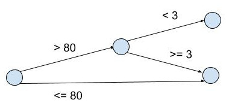

# Técnicas de Teste

**Caixa Branca**: Tem acesso ao código  
**Caixa Preta**: Não tem acesso ao código (libraries)  

---

* **Classes de Equivalência**
  * **Classes válida**
    * As entradas dos testes que deveriam dar certo
  * **Classes inválida**
    * As entradas dos testes que deveriam dar errado

Exemplo, um sistema requer senha  

| Entrada                          | Classes válidas   | Classes inváldas |
| :------------------------------: | :---------------: | :--------------: |
| Tamanho t da senha               | 1 ≤ t ≤ 6         | t > 6 ou t = 0   |
| Primeiro caractere c é uma letra | Sim               | Não              |

## Particionamento por Equivalência
Dado os lados, dizer o tipo de triângulo

| Classe de Equivalência        | a   | b   | c   | Resultado Esperado |
| :---------------------------: | :-: | :-: | :-: | :----------------: |
| Um lado maior que dois juntos | 7   | 3   | 3   | Não é triângulo    |
| Um lado maior que dois juntos | 3   | 7   | 3   | Não é triângulo    |
| Um lado maior que dois juntos | 3   | 3   | 7   | Não é triângulo    |
| Tamanho iguais                | 3   | 3   | 3   | Equilátero         |
| Dois lados são iguais         | 3   | 4   | 4   | Isóceles           |
| Dois lados são iguais         | 4   | 4   | 3   | Isóceles           |
| Dois lados são iguais         | 4   | 3   | 4   | Isóceles           |
| Tamanho iguais                | 3   | 4   | 5   | Escaleno           |

## Análise do Valor Limite
Os problemas costumam ocorre nos limites das faixas de valores.
A idade para entrar pagando inteira é de 18 até 64, abaixo ou acima disso paga meia.  

```
|-------------------------------|
18                             64
```
Valor limite é justamente o valor que altera a reação  
18 paga inteira, 17 paga meia.  
64 paga inteira, 65 paga meia.  

| Idade | Resultado Esperado |
| :---: | :----------------: |
| 18    | Inteira            |
| 17    | Meia               |
| 64    | Inteira            |
| 65    | Meia               |

## Grafo Causa-Efeito
A idéia é fazer um grafo com o leque de opções, dada uma entrada o caminho vai se separando conforme as opções.  

Produtos comprados online na loja XXX, tem frete gratis se o valor da compra for maior que 80 e forem menos que 3 produtos.

Primeira opção que você pode verificar nesse caso é se o preço dos produtos foi maior que 80.  
Segunda opção que você pode verificar é se são mais que 3 produtos.  

  
(essa vai ser a notação usada em aula, outra notação: Myers et al., 2012)

Após isso se faz a tabela decisão.  

Tabela clássica do Arndt:  

| Condições                   |   |   |   |
| :-------------------------: |:-:|:-:|:-:|
| Valor da compra > 80        | T | T | F |
| Quantidade de produtos > 3  | T | F | - |
| **Ações**                   |   |   |   |
| Frete Grátis                |   | x |   |
| Cobrar Frete                | x |   | x |

Mostrada em aula:

| Causa                  |      |      |       |
| :--------------------: |:----:|:----:|:-----:|
| Valor compra           | > 80 | > 80 | <= 80 |
| Quantidade de produtos | < 3  | >= 3 | --    |
| **Efeito**             |      |      |       |
| Frete Grátis           |  -   |  V   |  V    |
| Cobrar Frete           |  V   |  -   |  -    |

## Error Guessing
Usar a própria experiência de testador para advinhar testes que sejam bons fazer. É uma técnica informal, pois não existe regras. Normalmente essa técnica é utilizada para complementar as outras, não para se utilizar sozinha.  

Error Guessing: https://en.wikipedia.org/wiki/Error_guessing

# Behaviour Driven Developement
A idéia é escrever um esqueleto de código que o cliente também consiga ler e entender.  

Cenário A  
**Dado que** \_\_\_\_\_  
**Quando** \_\_\_\_\_   
**Então** \_\_\_\_\_  

Você pode adicionar **E** (and) para qualquer um dos 3.

Cenário B  
**Dado que** \_\_\_\_\_  
E \_\_\_\_\_  
E \_\_\_\_\_  
**Quando** \_\_\_\_\_   
E \_\_\_\_\_  
**Então** \_\_\_\_\_  
E \_\_\_\_\_  

Exemplo de uso:  

Cenário C  
**Dado que** usuário está logado    
E informou data de nascimento  
E idade maior que 17  
**Quando** tentar acessar a página do jogo   
E confirmar a idade  
**Então** exibir a página do jogo  
E oferecer para baixar  

Behavior-Driven Developement: https://en.wikipedia.org/wiki/Behavior-driven_development
