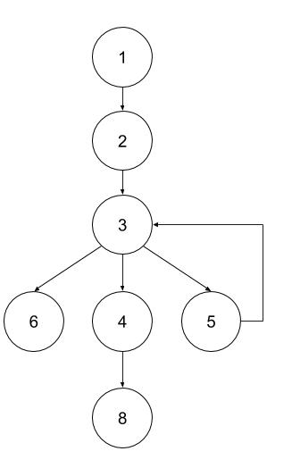
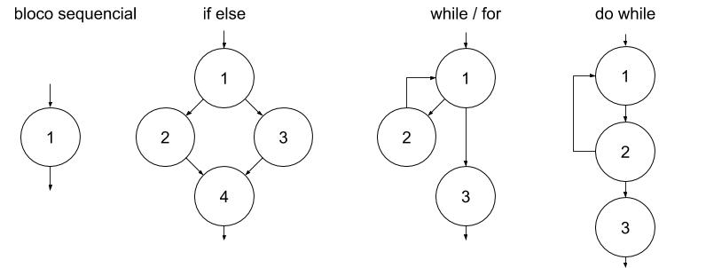
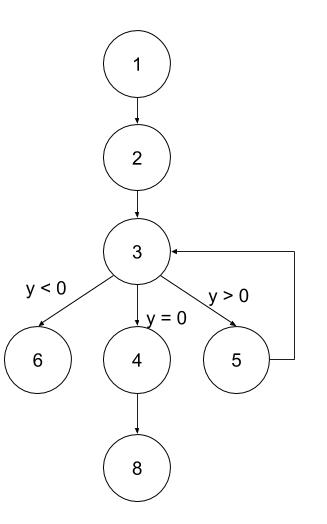
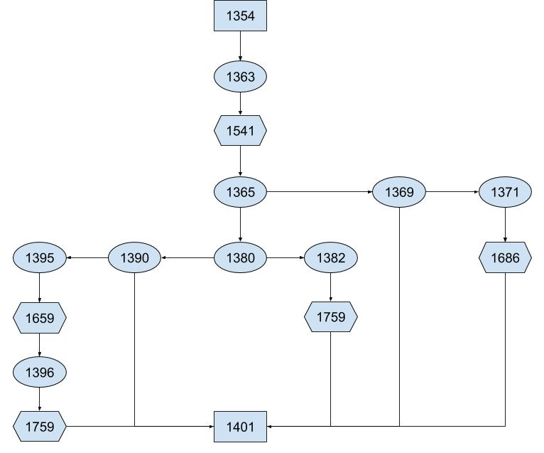
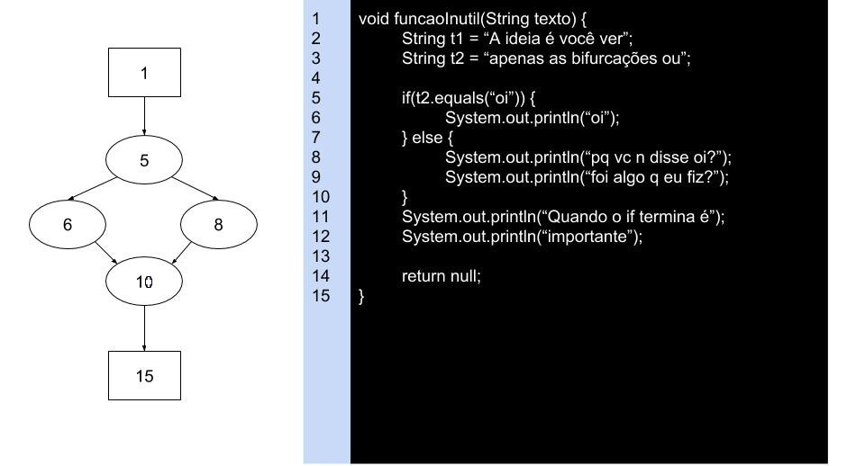
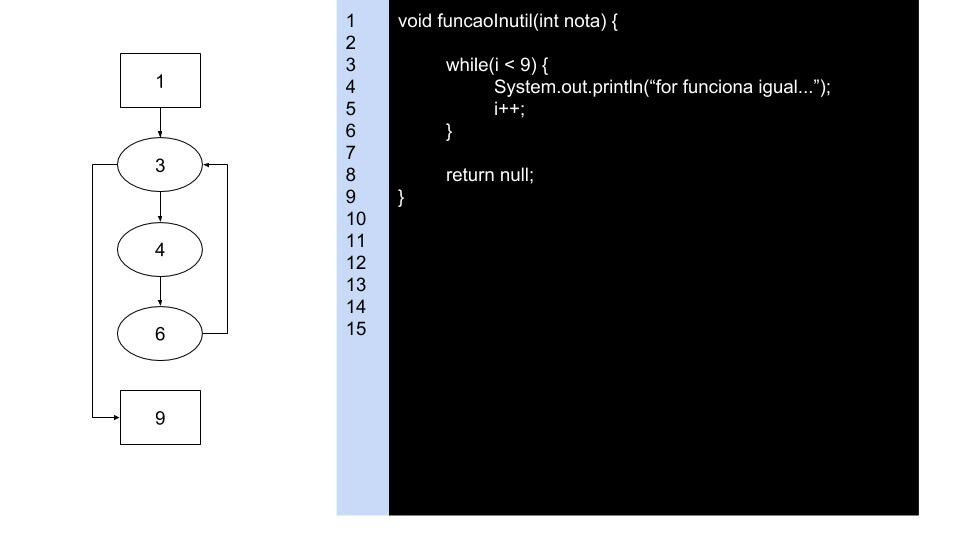
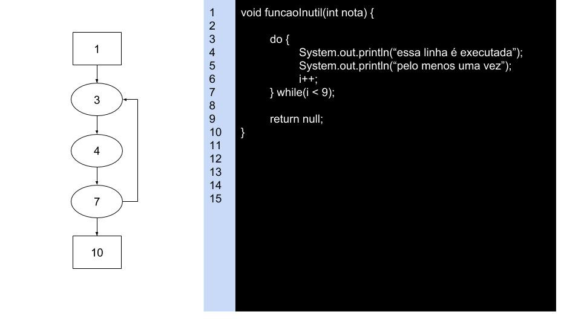

**Funcional**:  
Até agora foram visto técnicas **caixa preta**, ou seja, não ligavamos para o que acontecia dentro do software ou como foi implementado, apenas se o resultado estava correto.  

**Estrutural**:  
Agora nós vamos estudar técnicas **caixa branca**, nós veremos como o código foi escrito.  

Para seu teste ser de alta qualidade você precisa misturar as duas técnicas de modo a maximizar os benefícios.  

# Grafo de Programa

**Nó**: Uma sequência de códigos que não tem bifurcação, ou seja, não tem como tomar outro fluxo de comandos  
**Arco**: O caminho existente de um nó para outro nó  
**Caminho**: ???  
**Fluxo de Controle**: ???  

  

## Sintaxe

  

## Teste de Instruções  
Durante um caso de teste, a idéia é você testar todos os nós pelo menos uma vez, para isso você pode precisar rodar o programa mais que uma vez  

  

Pegando todos os nós:  
* 1,2,3,6  
* 1,2,3,5,3,4,8  

Pegando todos os arcos:  
* <1,2>, <2,3>, <3,6>  
* <1,2>, <2,3>, <3,5>, <5,3>, <3,4>, <4,8>  

Tabela:  

| nós | predicados | dados |
| --- | ---------- | ----- |
| {1,2,3,6} | ∀y, y < 0 | y = -10 |
| {1,2,3,5,3,4,8} | ∀y, y ≥ 0 | y = 10 |

## Arndt
A sintaxe ensinada pelo Arndt envolve utiliza  
Circulo: bloco sequencial  
Hexagono: Mudança de classe/função  
Retângulo: Inicio ou fim do escopo analisado  

Exemplo de um trabalho que tive que fazer em outra matéria:  

Estou falando isso pois não sei que sintaxe o professor vai cobrar já que ele mostra a sintaxe do Arndt e aquela anterior que são apenas circulos.    

### Exemplos
  

  

  

  
