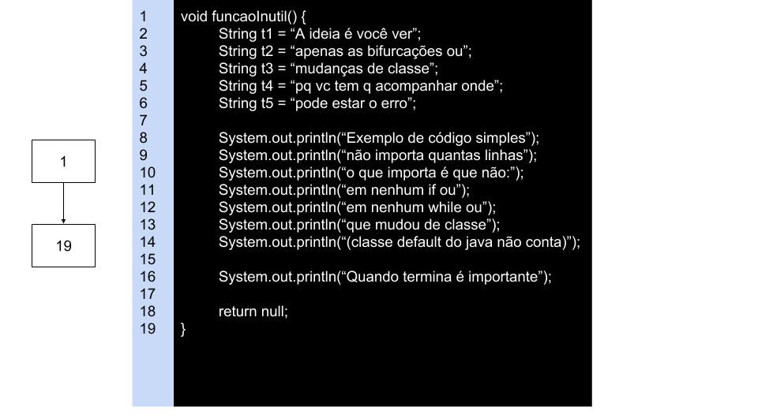

**Funcional**:  
Até agora foram visto técnicas **caixa preta**, ou seja, não ligavamos para o que acontecia dentro do software ou como foi implementado, apenas se o resultado estava correto.  

**Estrutural**:  
Agora nós vamos estudar técnicas **caixa branca**, nós veremos como o código foi escrito.  

Para seu teste ser de alta qualidade você precisa misturar as duas técnicas de modo a maximizar os benefícios.  

# Grafo de Programa

**Nó**: Uma sequência de códigos que não tem bifurcação, ou seja, não tem como tomar outro fluxo de comandos  
**Arco**: O caminho existente de um nó para outro nó  
**Caminho**: ???  
**Fluxo de Controle**: ???  

  

## Sintaxe

  

## Teste de Instruções  
A idéia é você testar todos os **nós** pelo menos uma vez, para isso você pode precisar rodar o programa mais que uma vez  

  

Pegando todos os nós:  
* 1,2,3,6  
* 1,2,3,5,3,4,8  

Tabela:  

| nós | predicados | dados |
| --- | ---------- | ----- |
| {1,2,3,6} | ∀y, y < 0 | y = -10 |
| {1,2,3,5,3,4,8} | ∀y, y ≥ 0 | y = 10 |


## Arndt
A sintaxe ensinada pelo Arndt envolve utiliza  
Circulo: bloco sequencial  
Hexagono: Mudança de classe/função  
Retângulo: Inicio ou fim do escopo analisado  

Exemplo de um trabalho que tive que fazer em outra matéria:  


Estou falando isso pois não sei que sintaxe o professor vai cobrar já que ele mostra a sintaxe do Arndt e aquela anterior que são apenas circulos.    

### Exemplos
  

  

  

  

## Teste de Decisões
A idéia é você testar todos os **arcos/arestas/ramos** pelo menos uma vez, para isso você pode precisar rodar o programa mais que uma vez  
Eu não consegui ver muita diferença de usar esse e o *teste de instruções*  

  

Pegando todos os arcos:  
* <1,2>, <2,3>, <3,6>  
* <1,2>, <2,3>, <3,5>, <5,3>, <3,4>, <4,8>  

Tabela:  

| nós | predicados | dados |
| --- | ---------- | ----- |
| {<1,2>, <2,3>, <3,6>} | ∀y, y < 0 | y = -10 |
| {<1,2>, <2,3>, <3,5>, <5,3>, <3,4>, <4,8>} | ∀y, y ≥ 0 | y = 10 |

### Restruturando código
A idéia não é realmente restruturar o código, apenas tentar ver ela de forma que facilite a analise das arestas. Um código pode ter várias avaliações na mesma linha, o que pode acabar nos levando a não testar todas possíveis arestas.   

Quando uma condição é muito grande, podemos querer abreviar, por exemplo:   
Vamos chamar `a >= 0 && a <= 200` de **C**.  

```java
if (a >= 0 && a <= 200) {
  m = 1
} else {
  m = 3
}
```


  

Como isso dificulta a nossa analise das condições no grafo, podemos **tentar** restruturar o código de forma a mostrar as condições separadas.  

```java
if (a >= 0) {
  if (a <= 200) {
    m = 1
  } else {
    m = 3
  }
} else {
  m = 3
}
```

  

Conseguimos ver todas condições no grafo, mas o código está se tornando ilegível.  
Outra maneira de restruturar o código seria trocando && por ||, ou seja, trocar and por or.  

```java
if (a < 0 || a > 200) {
  m = 3
} else {
  m = 1
}
```

  

Voltamos para o caso anterior, mas agora restruturar pode acabar sendo melhor  

```java
if (a < 0) {
  m = 3
} else if (a > 200) {
  m = 3
} else {
  m = 1
}
```

  

Infelizmente acabamos com repetição de código, como você pode ver pelo `m = 3`.  
Lado positivo é que conseguimos avaliar todas as arestas.  

## Teste de Caminhos
Eu não entendi a diferença desse teste para os outros 2.  
Você quer percorrer todos os caminhos possíveis pelo menos uma vez (acho que os outros também eram assim).  

### Teste de Caminhos Básicos
Em vez de procurar todos os caminhos, você procura todos os caminhos independentes.  
Caminho independente: contém pelo menos 1 nova aresta do grafo de controle  
(não é como se antes eu ficasse pegando caminhos inúteis e que eu já percorri...)  

Existe formulas para saber quantos caminhos independentes podemos ter no máximo (se passar desses valores, você repetiu algum percurso):  
* Nós predicados + 1
* Regiões + 1
* Arestas - nós + 2

Vamos pegar um exemplo anterior qualquer e utilizar as 3 maneiras    

Nós predicados + 1  
Em outras palavras, nós que tem bifurcações + 1  
  
2 + 1 = 3  

Regiões + 1  
Como pode ver, eu pintei todos as áreas fechadas  
  
2 + 1 = 3  

Arestas - nós + 2  
Conta as arestas  
  
Conta os nós  
  
7 - 6 + 2 = 3  

### Teste de Laços
Laços/loops podem conter diversos problemas, por isso é recomendado fazer testes neles. Por exemplo:  

1. Teste se da para pular o laço
2. Teste se da para executar o laço uma vez
3. Teste se da para executar o laço mais que uma vez (duas está bom)
4. Teste os limites do laço
  * Teste max - 1 vezes
  * Teste max vezes
  * Teste max + 1 vezes

Claro que nem sempre da para testar todas essas opções, a idéia é tentar pegar mais casos que podem dar erro.  

```java
void test(int i) {

  while(i < 10) {
    i++;
  }

}
```

Testando pular o laço `test(10);`  
Testando executar o laço uma vez `test(9);`  
Testando executar o laço duas vezes `test(8);`  
Testando limite max `test(0);` (não existe max nesse loop pois i poderia ser qualquer número negativo)  
Testando limite max + 1 `test(11);`  

## Teste de Fluxo de Dados
Analisa o comportamento das variáveis (dos dados), ou seja, você procura caminhos que fazem você alterar as variáveis.  

```java
int test(boolean b, boolean b2, int x) {
  if(b == true) {
    x += 2;
  }

  if(b2 == true) {
    x += 5;
  }

  return x;
}
```

  
<sub>\*Ignorei o nó final da função por preguiça</sub>  

Note que poderiamos formar os caminhos:  
1,2,3,4,6,8  
1,2,4,6,7,8  

Embora eles cubram todos os nós e arestas, eles não avaliam os dados  
No primeiro caminho x acabaria como x + 2  
No segundo caminho x acabaria como x + 5  

Mas não cobrimos todas as possibilidades do dados, vamos adicionar os seguintes    
1,2,3,4,6,7,8  
1,2,4,6,8  
Agora nós temos 4 caminhos, com 4 possibilidades do que pode acontecer com os dados  

| caminho | x |
| ------- | - |
| 1,2,3,4,6,8 | x + 2 |
| 1,2,4,6,7,8 | x + 5 |
| 1,2,3,4,6,7,8 | x + 7 |
| 1,2,4,6,8 | x + 0 |

#### Sub-caminhos
**Caminho-d-u**: (definition-use) É um caminho que marca onde a variável é definida e onde ela foi utilizada    

**Caminho-d-c**: (definition-clear) É um caminho que marca onde a variável é definida e até o final do caminho ela não é redefinida  

```java
String texto = "definindo um valor para a variável texto";

if(c2 == true) {
  System.out.println("estou utilizando a variável texto: ", text);
}
```

*Caminho-d-u*: 1,3,4,5  
*Caminho-d-c*: 1,3,5  

Note que uma variável pode ser definida e usada varias vezes  

```java
void funcao(boolean c) {
  String i = 3;

  if(c == true) {
    System.out.println("valor: ", i);
    i++;
    System.out.println("valor: ", i);
    i++
  }
}
```

| variável | definida (linha) | usada (linha) |
| --- | --- | --- |
| c | 1 | 4 |
| i | 2,6,9 | 5,7 |

1:02:09 aula13
